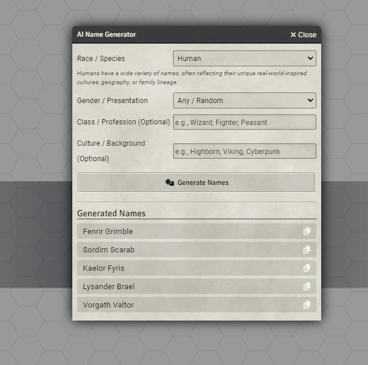

# Name Generator AI (Groq) for Foundry VTT

Um módulo completo para **Foundry Virtual Tabletop** focado na agilidade do Mestre e na Imersão dos Jogadores, utilizando Inteligência Artificial (Groq API + LLaMA 3.1) para gerar nomes únicos, baseados em raças, gêneros, profissões e culturas.

## Funcionalidades Principais
* **Gerador Orientado a Lógica:** O modelo não cospe nomes aleatórios de um banco de dados fixo. O módulo força a IA a **fundir conceitos e palavras traduzidas** baseadas no idioma da raça escolhida. (Ex: *Folha (Francês: feuille) + Chuva (Inglês: rain) = Feuain*)
* **Raças Customizáveis Categoria por Categoria:** Cada raça possui configurações finas.
* **Transparência de Criação:** A resposta gerada no Foundry inclui não só o nome do NPC, mas também a **Lógica (Etimologia)** por trás dele para que o Game Master possa contar aos jogadores o significado daquele nome élfico ou anão!
* **Acesso Rápido:** Copie o nome clicando no botão para transferir instantaneamente para a ficha do seu Actor.

---

## 🛠️ Como Instalar
1. Vá até o menu **Add-on Modules** no Foundry VTT.
2. Clique em **Install Module**.
3. No campo inferior *Manifest URL*, cole a URL:
   `https://raw.githubusercontent.com/trezecete/nameGeneratorAI/master/module.json`
4. Clique em **Install**.
5. Abra o seu mundo e ative o módulo "Name Generator AI (Groq)".

---

## ⚙️ Configuração (API Key)
Para que a inteligência artificial funcione, esse módulo utiliza a infraestrutura **gratuita e super veloz** da Groq.
1. Crie uma conta gratuita em [console.groq.com](https://console.groq.com/)
2. Na aba lateral, vá em **API Keys** e clique em **Create API Key**.
3. Copie o código gerado.
4. No Foundry, vá na aba **Settings** > **Configure Settings** > Aba **Name Generator AI**
5. Cole a sua chave no campo **Groq API Key**.

---

## 📝 Como Configurar Novas Raças/Espécies 
O verdadeiro poder do módulo está na capacidade de moldar os nomes para se encaixarem exatamente na *Lore* do seu mundo RPG. 
Vá nas **Configurações do Módulo** e clique no botão **Manage Race Templates**.

Ao adicionar ou editar uma raça (Template), você terá 4 campos cruciais que ditam o comportamento da IA:

### 1. UI Description
É a descrição básica da raça que vai aparecer na tela padrão para o mestre saber do que se trata.
* *Ex:* Nomes élficos soam musicais, melódicos e costumam refletir a natureza.

### 2. Word Categories
São os "Conceitos" que a I.A. deve usar para buscar palavras no dicionário que formarão o nome. Use palavras separadas por vírgula.
* *Ex: Natureza, Magia, Estrelas, Luz, Floresta, Prata*

### 3. Base Languages
Os idiomas reais do nosso mundo de onde a I.A deve traduzir as "Word Categories" antes de mesclá-las e deformá-las para criar uma palavra nova de Fantasia.
* *Ex: Francês, Latim, Galês, Finlandês*

### 4. Sonority / Name Style
O Estilo de pronúncia final a ser entregue. Guia a I.A se ela deve focar em consoantes mais duras e curtas (como Anões ou Orcs) ou consoantes fluidas e vogais (como Elfos).
* *Ex: Melódica, suave, fluida e majestosa, evitando consoantes muito duras.*

> Com o exemplo acima, o módulo ordenará a I.A a pensar em *Natureza ou Luz*, traduzir aleatoriamente para *Francês ou Latim* e misturar para que soe *Melódico e Majestoso*.

---

### Autor
- **trezecete**
- Atualizado e construído com requisições LLaMA para Foundry V11/V12.
